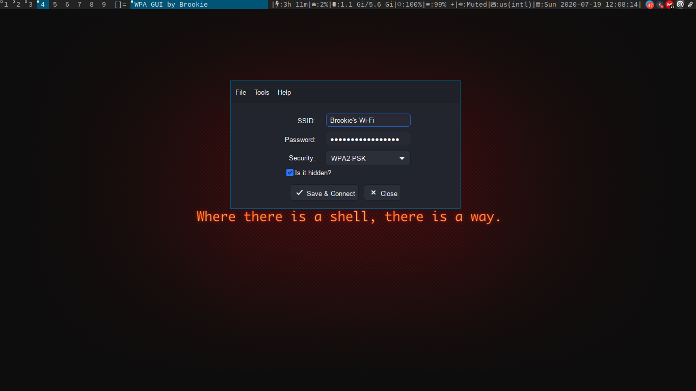
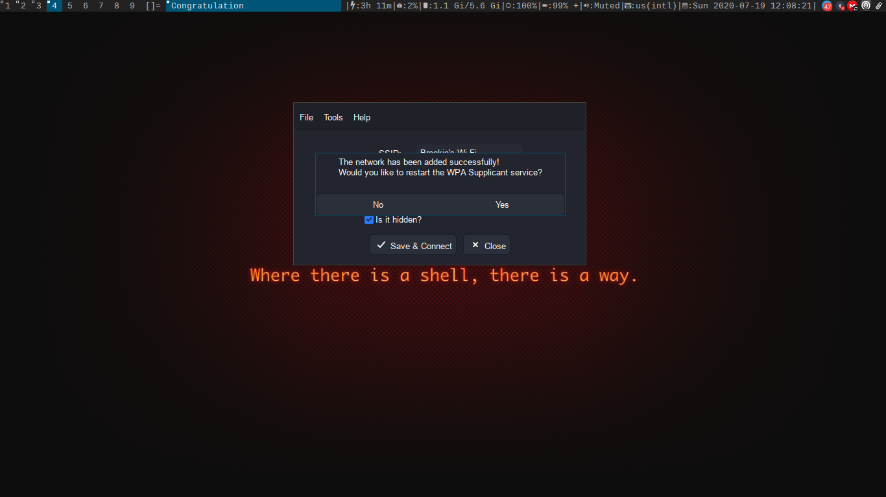
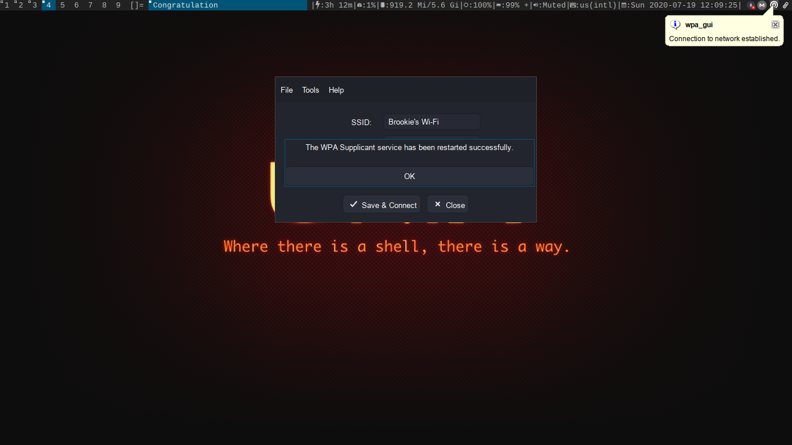

# WPA GUI
## Table of contents
- [What is it?](#what-is-it)
- [Dependencies](#dependencies)
  - [How to install the dependencies?](#how-to-install-the-dependencies)
- [Screenshots](#screenshots)

### What is it?
This is a simple tool to connect to Wi-Fi networks that use the WPA2 protocol.

### Dependencies
```
gcc
make
wpa_supplicant
gtk+3.0
```

#### How to install the dependencies?
Depending on your distribution use the corresponding command:
| Distribution                     | Command                                              |
|:---------------------------------|------------------------------------------------------|
|Debian/Ubuntu and derivatives     |`apt install gcc make libgtk-3-dev wpasupplicant`     |
|Fedora/CentOS/RHEL                |`dnf install gcc make gtk3-devel wpa_supplicant`      |
|Gentoo/Funtoo and derivatives     |`emerge --ask gcc make gtk+ wpa_supplicant`           |
|Arch Linux/Manjaro and derivatives|`pacman -S gcc make gtk3 wpa_supplicant`              |

#### Note
**You will need root permissions.**

### Screenshots



